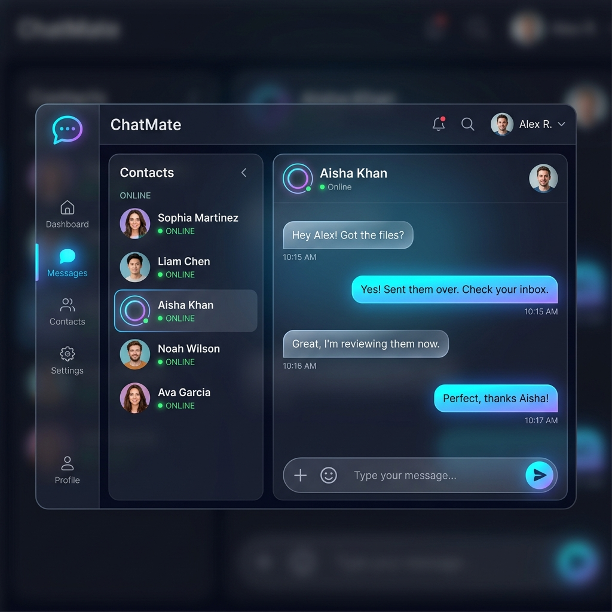

# 💬 ChatMate - Real-Time Instant Messaging Application

[](https://react.dev/)
[](https://nodejs.org/)
[](https://www.mongodb.com/)
[](https://socket.io/)
[](https://tailwindcss.com/)

A modern, full-stack real-time chat application built with the MERN stack and Socket.io. ChatMate offers instant one-on-one direct messaging, dynamic online/offline presence states, and responsive mobile-first layouts.

---

## 🔗 Live Link
- **Live Demo**: [chatmate-backend.onrender.com](https://chatmate-backend.onrender.com/)

---

## 🖥️ Application Preview



---

## 🌟 Key Features

- **⚡ Instant Real-Time Messaging**:
  - Exchange messages instantly using bi-directional WebSocket channels powered by **Socket.io**.
- **🟢 Presence Tracking**:
  - Live indicator system tracking user online/offline status updates reactively.
- **✍️ Typing Status Indicators**:
  - Real-time "Typing..." notification triggers displayed when users draft messages.
- **📂 Persistent Message Store**:
  - Secure conversations database schema storage using **MongoDB** & **Mongoose**, allowing chats to load reliably.
- **🔒 Secure JWT Authentication**:
  - Session verification using JSON Web Tokens (JWT) saved inside protected HttpOnly cookies.

---

## 🛠️ Tech Stack

### Frontend
- **Framework**: React.js & Vite
- **Styling**: Tailwind CSS & Lucide React
- **State Management**: Redux Toolkit & Context API

### Backend
- **Runtime**: Node.js & Express.js
- **Database**: MongoDB & Mongoose
- **Websockets**: Socket.io (for bi-directional real-time communication)
- **Security**: bcryptjs (password encryption), JWT token-based verification

---

## 📁 Project Structure

```text
chatting/
├── backend/              # Express API and Socket.io server
│   ├── models/           # Mongoose Schemas (User, Message, Conversation)
│   ├── routes/           # REST endpoint routing
│   └── index.js          # Express app mount & Socket listener setup
└── frontend/             # React Client App
    └── src/              # Pages, Chat panels, hooks, and context slices
```

---

## 🚀 Local Installation & Setup

### Prerequisites
- [Node.js](https://nodejs.org/) installed
- [MongoDB](https://www.mongodb.com/) account/database running (local or cloud)

### Step 1: Clone the Repository
```bash
git clone https://github.com/DIPANSHU66/chatting.git
cd chatting
```

### Step 2: Configure & Start Backend
1. Navigate to the `backend` folder and install dependencies:
   ```bash
   cd backend
   npm install
   ```
2. Create a `.env` file in the `backend/` directory:
   ```env
   PORT=8000
   MONGO_URI=your_mongodb_connection_string
   JWT_SECRET_KEY=your_jwt_secret_key
   FRONTEND_URL=http://localhost:5173
   ```
3. Start the backend development server:
   ```bash
   npm run dev
   ```

### Step 3: Configure & Start Frontend
1. Navigate to the `frontend` folder and install dependencies:
   ```bash
   cd ../frontend
   npm install
   ```
2. Create a `.env` file in the `frontend/` directory:
   ```env
   VITE_API_URL=http://localhost:8000/api/v1
   ```
3. Start the frontend development server:
   ```bash
   npm run dev
   ```
4. Open [http://localhost:5173](http://localhost:5173) in your browser.

---

## 🛡️ License & Contributions
This project is open-source. Contributions, issues, and feature requests are welcome!

---

*Made with ❤️ by [Dipanshu Bansal](https://github.com/DIPANSHU66)*
